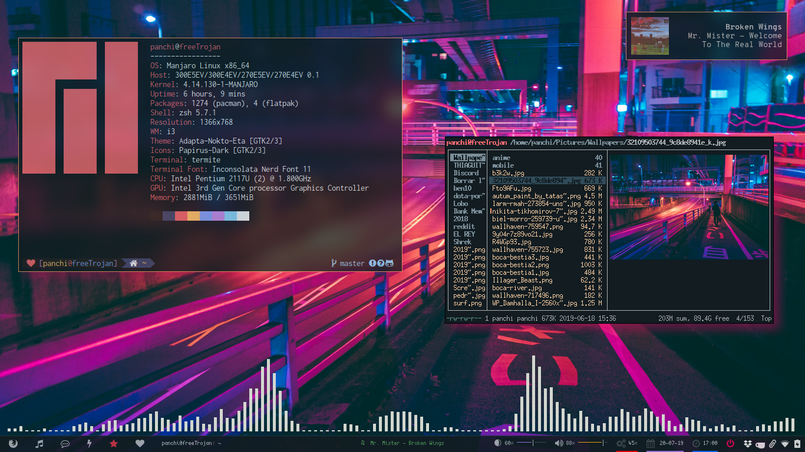
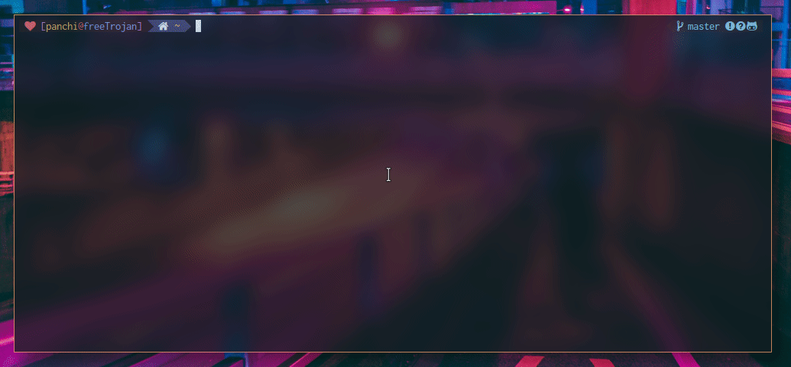
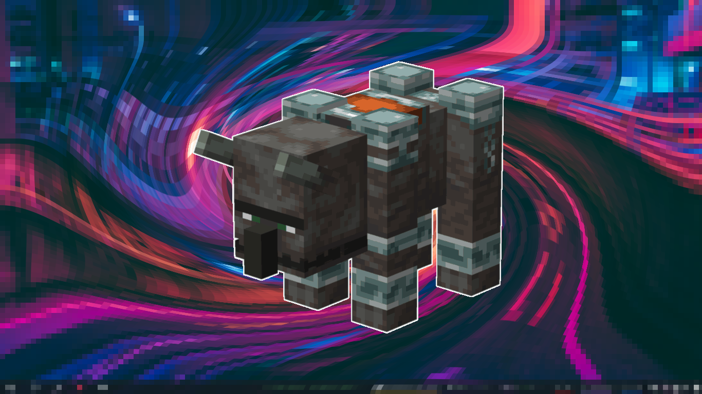
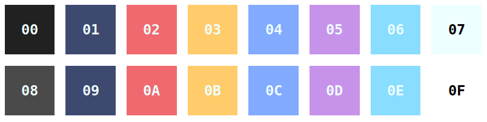

# Dotfiles :computer:



## Details :thinking:

+ **OS**: Manjaro Linux
+ **WM**: i3-gaps
+ **Terminal**: Termite
+ **Shell**: Zsh 
+ **Text editor**: Neovim
+ **Font**: Inconsolata Nerd Font 11
+ **Bar**: Polybar
+ **GTK Theme**: Adapta-Nokto-Eta
+ **Icon Theme**: Papirus
+ **Cursor Theme**: Capitaine Cursors

## Neovim :pencil:



## Lockscreen :lock:



## Color palette :art:




## Deploy :rocket:

1. Install [yay](https://github.com/Jguer/yay)
2. Install packages:
```bash
yay -S --needed $(< packages.txt)
```
3. Install manually:
   - [Oh My Zsh](https://github.com/ohmyzsh/ohmyzsh)
   - [zsh-autosuggestions](https://github.com/zsh-users/zsh-autosuggestions/blob/master/INSTALL.md#oh-my-zsh)
   - [vim-plug](https://github.com/junegunn/vim-plug#neovim)
   - [scientifica font](https://github.com/NerdyPepper/scientifica)
   - [apple emojis xd](https://github.com/samuelngs/apple-emoji-linux#installing-prebuilt-applecoloremoji-font)
   - [Powerlevel9k](https://github.com/Powerlevel9k/powerlevel9k/wiki/Install-Instructions#option-2-install-for-oh-my-zsh)
4. Clone this repository
5. Copy the files you want to change
6. :tada::confetti_ball:
