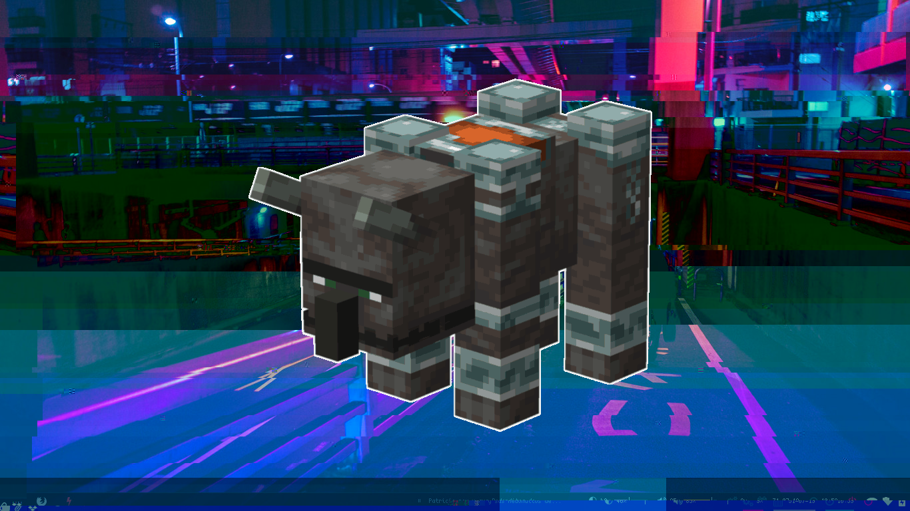

# Dotfiles :computer:

## Details :thinking:

+ **OS**: Manjaro Linux
+ **WM**: i3-gaps
+ **Terminal**: Termite
+ **Shell**: Zsh 
+ **Text editor**: Neovim
+ **Font**: Inconsolata Nerd Font 11
+ **Bar**: Polybar
+ **GTK Theme**: Adapta-Nokto-Eta
+ **Icon Theme**: Papirus
+ **Cursor Theme**: Capitaine Cursors

## Neovim :pencil:

## Lockscreen :lock:

## Color palette :art:

